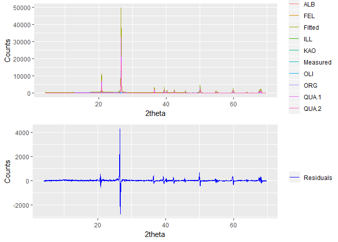
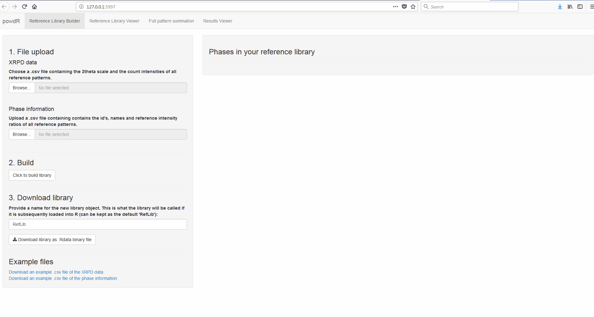
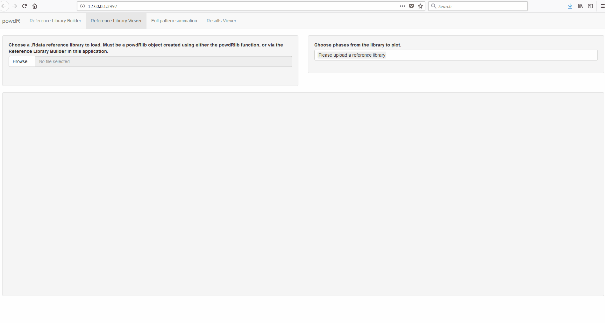
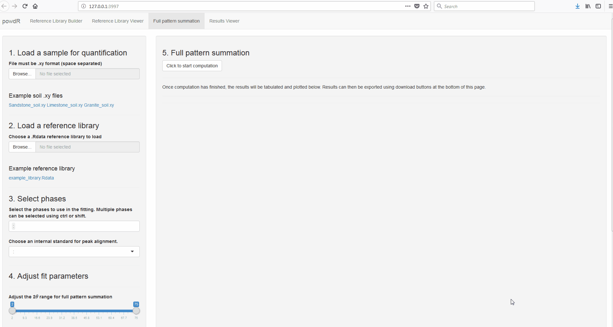

powdR: full pattern summation of XRPD data
================

<!-- README.md is generated from README.Rmd. Please edit that file -->
Overview
--------

`powdR` is an implementation of the full pattern summation approach to quantitative mineralogy from X-ray powder diffraction data (Chipera and Bish 2002; Chipera and Bish 2013; Eberl 2003). Version 0.1.0 contains functionality for a standardless approach, which assumes all phases within a sample can be identified, and thus they sum to 100 %. Future versions of `powdR` seek to add functionality for samples prepared with an internal standard.

`powdR` has two major advantages over the excel based implementations of full pattern summation such as FULLPAT (Chipera and Bish 2002) and ROCKJOCK (Eberl 2003). First, computation is faster and, when quantifying multiple samples, can be used in combination with the [`foreach`](https://cran.r-project.org/web/packages/foreach/index.html) package for parralel processing. Secondly, powdR can be run via a `shiny` web application, which offers a user friendly interface for fast and iterative mineral quantification.

Installation via Github
-----------------------

``` r
#Install devtools if you don't already have it on your machine
devtools::install_github('benmbutler/powdR')

#alternatively, an installation that builds the vignette to help explain
#the current functionality of powdR
devtools::install_github('benmbutler/powdR', build_vignettes = TRUE)
```

Usage
-----

``` r
library(powdR)
#> powdR: full pattern summation of X-ray powder diffraction data

#Load some soils to quantify
data(soils)

#Load a reference library of pure patterns
data(minerals)

#Quantify a sample
q <-  fps(lib = minerals,
          smpl = soils$sandstone,
          refs = minerals$phases$phase_id,
          std = "QUA.1")

#Inspect the phase concentrations (summarised by name)
q$phases_summary
#>       phase_name phase_percent
#> 1         Illite      1.596612
#> 2     K-feldspar      1.196130
#> 3      Kaolinite      1.443455
#> 4 Organic-Matter     38.848924
#> 5    Plagioclase      1.240560
#> 6         Quartz     55.674320

#Inspect the quantification
plot(q)
```



Alternatively, `plot(q, interactive = TRUE)` provides an interative plot for better inspection of the fit. More detailed usage instructions are provided in the package vignette.

Shiny app
---------

To run `powdR` via the shiny app, use `run_powdR()`. This loads the application in your default web browser. The application has four tabs:

1.  Reference library builder: Allows you to create a reference library from two csv files. One for the XRPD measurements, and the other for the ID, name and reference intensity ratio of each pattern.
2.  Reference library Viewer: For quick inspection of the phases within a reference library.
3.  Full pattern summation: A user friendly interface for iterative full pattern summation of single samples.
4.  Results viewer: Allows for quick inspection of results derived from full pattern summation.

### Example 1: Reference library builder



### Example 2: Reference library viewer



### Example 3: Full pattern summation



### Example 4: Results viewer


References
----------

Chipera, Steve J., and David L. Bish. 2002. “FULLPAT: A full-pattern quantitative analysis program for X-ray powder diffraction using measured and calculated patterns.” *Journal of Applied Crystallography* 35 (6): 744–49. doi:[10.1107/S0021889802017405](https://doi.org/10.1107/S0021889802017405).

———. 2013. “Fitting Full X-Ray Diffraction Patterns for Quantitative Analysis: A Method for Readily Quantifying Crystalline and Disordered Phases.” *Advances in Materials Physics and Chemistry* 03 (01): 47–53. doi:[10.4236/ampc.2013.31A007](https://doi.org/10.4236/ampc.2013.31A007).

Eberl, D. D. 2003. “User’s guide to ROCKJOCK - A program for determining quantitative mineralogy from powder X-ray diffraction data.” Boulder, CA: USGS.
