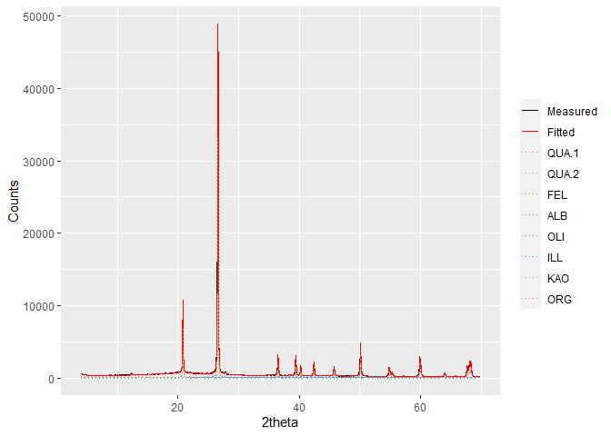

powdR: Full Pattern Summation of X-Ray Powder Diffraction Data
================

<!-- README.md is generated from README.Rmd. Please edit that file -->
[](https://travis-ci.org/benmbutler/powdR) [](https://CRAN.R-project.org/package=powdR) [](https://cran.r-project.org/package=powdR)

Overview
--------

`powdR` is an implementation of the full pattern summation approach to quantitative mineralogy from X-ray powder diffraction data (Chipera and Bish 2002; Chipera and Bish 2013; Eberl 2003). More specifically, `powdR` implements a standardless approach, which assumes all phases within a sample can be identified, and thus they sum to 100 %.

`powdR` has several advantages over the excel based implementations of full pattern summation such as FULLPAT (Chipera and Bish 2002) and ROCKJOCK (Eberl 2003). First, computation is faster and, when quantifying multiple samples, can be used in combination with other packages (e.g [`foreach`](https://cran.r-project.org/web/packages/foreach/index.html)) for parralel processing. Secondly, powdR can be run via a `shiny` web application, which offers a user friendly interface for fast and iterative mineral quantification. Lastly, R represents a powerful tool for data manipulation, allowing users to creatively adapt, pre-treat and visualise their XRPD data.

Installation
------------

The stable version of `powdR` is on CRAN:

``` r
install.packages("powdR")
```

Alternatively, the development version can be downloaded from Github

``` r
#Install devtools if you don't already have it on your machine
install.packages("devtools")

devtools::install_github('benmbutler/powdR')
```

Usage
-----

``` r
library(powdR)
#> powdR: Full Pattern Summation of X-Ray Powder Diffraction Data

#Load some soils to quantify
data(soils)

#Load a powdRlib reference library of pure patterns
data(minerals)

#Quantify a sample
q <-  fps(lib = minerals,
          smpl = soils$sandstone,
          refs = minerals$phases$phase_id,
          std = "QUA.1")
#> 
#> -Using maximum tth range
#> -Using default alignment of 0.1
#> -Using default solver of BFGS
#> -Using default shift of 0
#> -Using default objective function of Rwp
#> -Aligning sample to the internal standard
#> -Interpolating library to same 2theta scale as aligned sample
#> -Optimising...
#> -Removing negative coefficients and reoptimising...
#> -Computing phase concentrations
#> ***Full pattern summation complete***

#Inspect the phase concentrations (summarised by name)
q$phases_summary
#>       phase_name phase_percent
#> 1         Illite        1.2376
#> 2     K-feldspar        1.2509
#> 3      Kaolinite        1.3908
#> 4 Organic-Matter       39.8058
#> 5    Plagioclase        1.1593
#> 6         Quartz       55.1557

#Inspect the quantification
plot(q, wavelength = "Cu")
```



Alternatively, `plot(q, wavelength = "Cu", interactive = TRUE)` provides an interactive plot for better inspection of the fit. More detailed usage instructions are provided in the package vignette.

The powdR Shiny app
-------------------

To run `powdR` via the shiny app, use `run_powdR()`. This loads the application in your default web browser. The application has six tabs:

1.  **Reference Library Builder:** Allows you to create and export a `powdRlib` reference library from two .csv files: one for the XRPD measurements, and the other for the ID, name and reference intensity ratio of each pattern.
2.  **Reference Library Viewer:** Facilitates quick inspection of the phases within a `powdRlib` reference library.
3.  **Reference Library Editor:** Allows the user to easily subset a `powdRlib` reference library .
4.  **Full Pattern Summation:** A user friendly interface for iterative full pattern summation of single samples.
5.  **Automated Full Pattern Summation:** A user friendly interface for automated full pattern summation of single samples.
6.  **Results viewer:** Allows for quick inspection of results derived from full pattern summation.

References
----------

Chipera, Steve J., and David L. Bish. 2002. “FULLPAT: A full-pattern quantitative analysis program for X-ray powder diffraction using measured and calculated patterns.” *Journal of Applied Crystallography* 35 (6): 744–49. doi:[10.1107/S0021889802017405](https://doi.org/10.1107/S0021889802017405).

———. 2013. “Fitting Full X-Ray Diffraction Patterns for Quantitative Analysis: A Method for Readily Quantifying Crystalline and Disordered Phases.” *Advances in Materials Physics and Chemistry* 03 (01): 47–53. doi:[10.4236/ampc.2013.31A007](https://doi.org/10.4236/ampc.2013.31A007).

Eberl, D. D. 2003. “User’s guide to ROCKJOCK - A program for determining quantitative mineralogy from powder X-ray diffraction data.” Boulder, CA: USGS.
